# MedAlert — QA Bug Log (English)

> This is the English version of [BUGS.md](BUGS.md), prepared as a final deliverable. The Portuguese version remains the working copy; this one is a faithful translation, kept in sync manually.
>
> Bug log compiled from manual testing plus full code review, for presentation purposes.
> Organized by **chronological order of system usage** (business flow): registration first, then login, then authenticated usage (viewing patients → nursing records vital signs → alert management → doctor actions). Each entry also indicates **severity** and **layer** (Back-end, Front-end, or both).
>
> Every bug has a **"How to test (step-by-step)"** section — any of them can be reproduced just by clicking through the screen, no programming knowledge required. Some require opening the **browser Console** (F12) because the action (POST/PUT) can't be triggered just by typing an address in the bar — the step-by-step explains exactly what to paste there.

## Quick glossary (technical terms used below)

- **Browser Console (DevTools):** a hidden panel in the browser, meant for whoever develops the site. Opens with the **F12** key (or right-click → "Inspect" → "Console" tab). You can paste a small command there and it runs immediately, as if the site itself were doing it.
- **`fetch(...)`:** the command you paste into the Console to make the browser call an API route directly (e.g., "discharge a patient"), without clicking any button on the screen. Just copy and paste exactly as written in the step-by-step.
- **JSON:** the text format the API returns as a response, like `{"ok":true}`. It's just a way of organizing information as `"name": value` pairs — readable directly.
- **Timestamp (e.g., `1790081356243`):** the way the system stores "when something happened" — it's the number of milliseconds (1/1000 of a second) counted since January 1st, 1970. You don't need to understand the number itself, just that **the smaller it is, the older** the record is.
- **Hash (password):** a password "scrambled" in a way that can't be unscrambled back. A correct system never stores the exact password, only this scrambled form — and compares by scrambling again at login time.
- **IDOR:** stands for "Insecure Direct Object Reference" — in practice, it means the system lets you access **someone else's** data just by changing a number/ID in the URL or request, without checking whether you have permission for that.
- **Session cookie:** a "badge" the browser keeps after login, proving who you are on subsequent requests. Automatically reused if you open a new tab in the same browser (that's why some tests ask you to open "a new tab" instead of logging in again).

### Test type (Black-box / Gray-box / White-box)

Each bug below indicates how it was found, because that changes how easy it is to reproduce/explain to someone without access to the code:

- **Black-box:** found purely by testing through the screen/API, with no "inside" access to the system needed — the most traditional kind of test (I typed X, expected Y, got Z).
- **Gray-box:** required partial "inside" access — querying the database directly, looking at the raw API response in the Console/DevTools, or calling a route the screen never uses — but **without** needing to read the source code logic.
- **White-box:** could only be found (or have its cause confirmed) by **reading the source code** — no screen-based test, however creative, would reveal it on its own.

### Category

- **Security:** someone can do something they shouldn't be able to (view/change someone else's data, bypass login).
- **Functional:** a system rule doesn't work as it should (wrong calculation, missing validation).
- **Data integrity:** information becomes inconsistent or is lost/overwritten unintentionally.
- **Usability (UX):** missing clarity or protection for the user (no confirmation, stale counter).
- **Visual:** the screen doesn't correctly reflect what's actually happening underneath.

## Summary

| Flow stage | ID | Bug | Severity | Layer | Test type | Category |
|---|----|-----|------------|--------|--------|-----------|
| 1. User registration | BUG-001 | Passwords stored in plain text (no hashing) | Critical | Back-end | Gray-box | Security |
| 1. User registration | BUG-002 | Stored XSS: registration name rendered without escaping in 9 screens | Critical | Front-end + Back-end | Black-box | Security |
| 1. User registration | BUG-003 | Registration email validation accepts invalid domain/TLD | Medium | Back-end | Black-box | Functional |
| 1. User registration | BUG-004 | Registration accepts emoji in name, email, and password, with no sanitization | Medium | Back-end | Black-box | Functional |
| 2. Login | BUG-005 | Login only requires 1 password character and never checks if it's correct | Critical | Back-end | Black-box | Security |
| 2. Login | BUG-006 | User directory exposed publicly without login | High | Back-end | Gray-box | Security |
| 2. Login | BUG-007 | Production data reset with no authentication | High | Back-end | Black-box | Security |
| 3. Post-login (viewing patients) | BUG-008 | IDOR — any user can read any patient's data | Critical | Back-end | Gray-box | Security |
| 4. Nursing — vital signs | BUG-009 | Inconsistent temperature unit (°F on screen, °C in the rule) | High | Front-end + Back-end | Black-box | Functional |
| 4. Nursing — vital signs | BUG-010 | No range validation on vital signs (accepts negative/absurd values) | High | Front-end + Back-end | Black-box | Functional |
| 4. Nursing — vital signs | BUG-011 | High-HR threshold uses `>` instead of `>=` (boundary error) | Medium | Back-end | Black-box | Functional |
| 4. Nursing — vital signs | BUG-012 | Duplicate alerts when the same vital sign is recorded repeatedly | Medium | Back-end | Black-box | Functional |
| 5. Alert management | BUG-013 | Automatic escalation of critical alerts never happens | High | Back-end | White-box | Functional |
| 5. Alert management | BUG-014 | An alert can be "acknowledged" more than once, overwriting the record | Medium | Back-end | Gray-box | Data integrity |
| 5. Alert management | BUG-015 | No flow control between Acknowledge/Escalate (inconsistent status and audit trail) | Medium | Back-end | Gray-box | Data integrity |
| 5. Alert management | BUG-016 | "Pending alerts" counter at the top goes stale | Low | Front-end | Black-box | Usability (UX) |
| 5. Alert management | BUG-017 | "Acknowledge" alert button asks for no confirmation | Low | Front-end | Black-box | Usability (UX) |
| 6. Doctor — thresholds/prescription/discharge | BUG-018 | IDOR — any user can alter/discharge/prescribe for any patient | Critical | Back-end | Gray-box | Security |
| 6. Doctor — thresholds/prescription/discharge | BUG-019 | Prescription "saved successfully" with no patient selected (silent failure) | High | Front-end + Back-end | Black-box | Functional |
| 6. Doctor — thresholds/prescription/discharge | BUG-020 | Patient discharge with no confirmation screen | Low | Front-end | Black-box | Usability (UX) |
| 6. Doctor — thresholds/prescription/discharge | BUG-021 | "Discharge" button still looks active even though it's disabled | Low | Front-end | Black-box | Visual |

---

# 1. User registration

## BUG-001 — Passwords stored in plain text (no hashing)

- **Severity:** Critical (Security)
- **Layer:** Back-end
- **Test type:** Gray-box (had to query the database directly — you can't see the raw password just through the screen)
- **Category:** Security
- **Evidence in code:** [server/routes/auth.js:60-61](server/routes/auth.js#L60-L61) — on registration, the password received from the form is stored **exactly as received**, without going through any hashing function (`bcrypt`, `argon2`, `scrypt`, etc. — none of these libraries is even imported in the project):
  ```js
  db.prepare('INSERT INTO users (id, role, name, email, password) VALUES (?,?,?,?,?)')
    .run(id, role, name.trim(), email.trim(), password);
  ```

### How to test (step-by-step)
1. Open MedAlert and click **"Sign up"** ("Cadastre-se").
2. Register any account (e.g., name "Password Test", email `password.test@medalert.test`, password `123456`).
3. Open the file `data/medalert.db` in VS Code (with the SQLite extension already installed) — or ask someone to run a query on the `users` table for you.
4. Find the row for the account you just created and look at the `password` column.

**Expected:** something unreadable should appear, like `$2b$10$K3jH8x...` (a *hash* — see glossary at the top of the document).
**Actual (bug):** exactly `123456` appears, identical to what was typed.

### Confirmed in manual testing (direct database query)
I queried the `users` table directly and everyone's password shows up **readable**, exactly as typed at registration/seed time:

| User | Password stored in DB |
|---|---|
| Marina Souza, Roberto Lima, Camila Duarte, Paulo Ferreira, Dr. Helena Prado (seed) | `senha123` |
| Test account registered with `123456` | `123456` |
| Test account registered with emoji `🫶🫶🫶🫶🫶🫶` | `🫶🫶🫶🫶🫶🫶` |

### Expected result
Passwords should never be stored in plain text. The industry standard is to hash them (e.g., `bcrypt.hash(password, 10)`) at registration and compare with `bcrypt.compare()` at login — that way, even if the database leaks, nobody recovers the original password.

### Impact
This kind of flaw would already be critical on its own in any real system — and if BUG-005 (login accepting any password) is ever fixed, the problem doesn't go away: it would still expose everyone's real password to anyone with read access to the database (backup, dump, leak, or even a developer with access to the `data/medalert.db` file). Combined with BUG-005, the data isn't even *necessary* to hijack an account today — but it's a ticking time bomb that hasn't gone off only because another bug (missing password check) is "hiding" the problem.

### Evidence (screenshot)
<!-- Paste screenshot(s) for this bug here -->
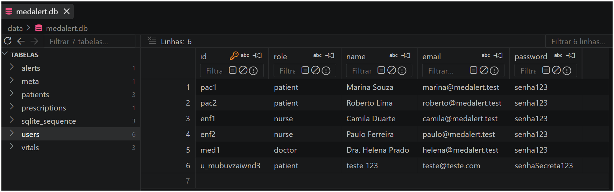

---

## BUG-002 — Stored XSS: the registration "Full name" field is inserted without escaping in 9 different screens

- **Severity:** Critical (Security)
- **Layer:** Front-end + Back-end
- **Test type:** Black-box (pasting HTML into the Full name field and checking whether it becomes a real element on screen is a behavior test, no code reading required)
- **Category:** Security
- **Evidence (Back-end):** [server/routes/auth.js:50](server/routes/auth.js#L50) doesn't filter or sanitize the name content — accepts `<`, `>`, `"`, and any HTML.
- **Evidence (Front-end):** the user's name is interpolated **raw**, inside a template string, directly into `innerHTML`, in at least 9 places in [public/app.js](public/app.js), with no escaping at all:
  - line 97 — logged-in user's name at the top (`topbar`)
  - line 110 — `<option>` in the login selector (see caveat below)
  - lines 272 and 409 — patient name in the nursing/doctor sidebar
  - lines 317, 343, 451, 475, 494 — patient name in various tab titles (vital signs, alerts, thresholds)

- **⚠️ Important correction (found while automating the test in Cypress, with a real browser):** the `<option>` in the login selector (line 110) **is not a good PoC** — browsers, per the HTML parsing spec itself, **discard** non-text tags (like ``) when they appear inside a `<select>`/`<option>`. In other words, this specific spot doesn't execute the payload, even though it receives unescaped HTML. This **doesn't invalidate the bug**: the other 8 spots listed (`topbar`, sidebar, tab titles) are regular `<div>`/`<span>`/`<h3>` elements, with no such restriction, and execute the payload normally — only the initial reproduction example (via the login screen) was wrong.

### Steps to reproduce (corrected)
1. Go to "Sign up".
2. In the **Full name** field, enter: `Test`
3. Fill in email/password and submit the registration normally.
4. Log in with that same account: go back to the home screen, in the **"User"** field select the account you just created (it will appear in the list with the name you typed), in the **"Password"** field type anything (e.g., `x` — works because of BUG-005), and click **"Log in"**. The payload fires when rendering the **header** at the top of the screen, which shows the logged-in user's name.

### Confirmed in automated testing (Cypress, real Electron/Chromium browser)
Test in [cypress/e2e/cadastro.cy.js](cypress/e2e/cadastro.cy.js) — registers the account with the payload, logs in with it, and checks whether the malicious tag exists inside `.topbar`. Actual execution result:
```
AssertionError: Timed out retrying after 4000ms: Expected  not to exist in the DOM, but it was continuously found.
```
In other words, the `` tag **was actually created** in the header's DOM, confirming real execution of the injected HTML — it's not just "dirty" data in the database, it's HTML/JS actually interpreted by the browser. (The equivalent test using the login selector, on the other hand, passes — reinforcing the caveat above.)

I also confirmed via API that the data is stored **raw** in the database (`"Test"`) and that `/api/auth/directory` returns that value with no escaping at all — the root cause (front-end never escapes anything) is the same for all 8 valid exploitation points.

### Why this is worse than "just" a common XSS
- Since patient registration automatically links to the first nurse and the first doctor in the system (a naive assignment rule, see "Additional observations" at the end of this document and [FEATURES.md](FEATURES.md) FEATURE-001), this malicious name also shows up in the **authenticated sidebar** of the responsible nurse and doctor (lines 272/409) — meaning the attack doesn't depend only on the attacker themselves logging in; it also executes inside the logged-in session of a real healthcare professional, with that professional doing nothing more than looking at the patient list.
- The session cookie is `httpOnly` (can't be read directly via `document.cookie`), but that doesn't neutralize the attack: a script running in the nurse's/doctor's session could simply **make calls to the API itself, as if it were that user** (`fetch('/api/patients/...')`, etc.) — and, combined with BUG-008/BUG-018 (IDOR), a script like that could sweep through and leak the medical records of **every patient in the system**, all because someone self-registered with a malicious name.

### Expected result
Never insert user-provided data directly into `innerHTML`. Either escape the text before interpolating (convert `<`, `>`, `"`, `&` to their corresponding HTML entities), or build the elements via the DOM (`textContent`) instead of HTML strings.

### Evidence (screenshot)
<!-- Paste screenshot(s) for this bug here -->
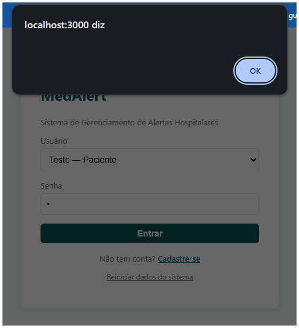

---

## BUG-003 — Registration email validation accepts a clearly invalid domain/TLD

- **Severity:** Medium (Data quality)
- **Layer:** Back-end
- **Test type:** Black-box (just try odd email values and see if registration accepts them)
- **Category:** Functional
- **Evidence in code:** [server/routes/auth.js:7](server/routes/auth.js#L7) — `const EMAIL_RE = /^[^\s@]+@[^\s@]+\.[^\s@]+$/;`. This rule only requires "something, at sign, something, dot, something", without checking whether the part after the dot is a real TLD, with no length limit, and even accepting a purely numeric TLD.

### Steps to reproduce
1. On the MedAlert home screen, click **"Sign up"**.
2. Fill in **Full name** with anything (e.g., "TLD Test").
3. Fill in **Email** as `a@a.123456` (a TLD made only of numbers, clearly invalid).
4. Fill in **Password** and **Confirm password** with anything 6 characters or longer (e.g., `123456`).
5. Leave the **Role** field as "Patient" and click **"Register"**.
6. (Extra proof, optional) Go back to the home screen: in the **"User"** field select the account you just created, in the **"Password"** field type anything (e.g., `x`), click **"Log in"** — the login works normally, proving it's not just dirty data saved somewhere, it's a real, usable account.

### Actual result (confirmed in manual testing + via API)
Registration is accepted normally (`{"ok":true}`) for `a@a.commmmmmmmmmmmmm`, `a@a.a`, and `a@a.123456` — none of these is a real email address, but all of them pass validation.

### Expected result
Email should be validated against a stricter pattern (alphabetic TLD with a plausible length — 2 to ~24 characters — or, ideally, confirmation via a link sent to the email, which is the most reliable way to confirm the address really exists).

### Confirmed in automated testing (Cypress, real Electron/Chromium browser)
The test registers the account with the invalid-TLD email, confirms the success toast, and then **logs in with that same account** (exploiting BUG-005 — any 1-character password works) to show, live, that it's not just dirty data saved in the database: it's a real, authenticatable, usable account. The final assertion expects the header (`.topbar`) **not** to appear (since an account like this shouldn't even exist) — but it appears, so Cypress keeps retrying for 4 seconds (the default retry timeout) before giving up and failing. Actual execution result:
```
AssertionError: Timed out retrying after 4000ms: Expected <header.topbar> not to exist in the DOM, but it was continuously found.
```
In other words, the header **was actually rendered**, confirming the login worked normally with this account. That ~4s delay before failing is expected — it's not a hang or a script error, it's Cypress waiting out the default timeout before assuming the element will never disappear.

### What was tested and is **not** a bug (validations that work correctly)
- **Duplicate full name:** accepted — shouldn't be blocked anyway, a person's name isn't a unique identifier.
- **Email already registered:** correctly rejected (`409 An account with this email already exists`) — [server/routes/auth.js:56-57](server/routes/auth.js#L56-L57).
- **Password ≠ Confirm password:** correctly rejected (`400`) — [server/routes/auth.js:54](server/routes/auth.js#L54).

### Evidence (screenshot)
<!-- Paste screenshot(s) for this bug here -->
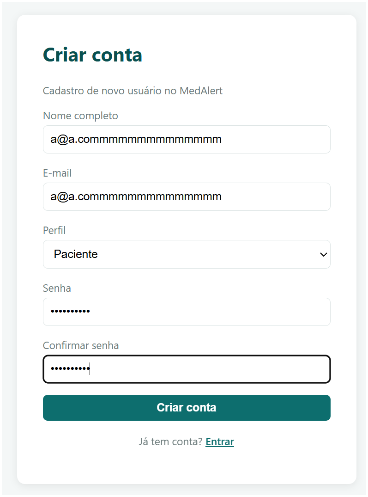

---

## BUG-004 — Registration accepts emoji in name, email, and password, with no character sanitization at all

- **Severity:** Medium (Data quality / potential broken display on other screens)
- **Layer:** Back-end (Front-end also doesn't validate the format before sending)
- **Test type:** Black-box (just test name/email/password with emoji and see if registration accepts them)
- **Category:** Functional
- **Evidence in code:**
  - Name: [server/routes/auth.js:50](server/routes/auth.js#L50) only checks `!name || !name.trim()` — accepts any character, including emoji.
  - Email: [server/routes/auth.js:7](server/routes/auth.js#L7) — the same `EMAIL_RE` from BUG-003 (`/^[^\s@]+@[^\s@]+\.[^\s@]+$/`) doesn't exclude emoji, only blocks spaces and `@`; any other Unicode character (including emoji) passes.
  - Password: [server/routes/auth.js:53](server/routes/auth.js#L53) only checks `password.length < 6` — doesn't validate character type, only quantity. Since emoji outside the Unicode basic plane (e.g., 🫶) take up 2 positions in JavaScript's `length`, a few emoji are enough to "fill" the minimum of 6. For the same reason, a password of **6 blank spaces** (`"      "`) is also accepted — `length` is 6, it doesn't matter that it's all invisible.

### Steps to reproduce
1. On the MedAlert home screen, click **"Sign up"**.
2. Fill in **Full name** with emoji (e.g., `🫶🫶🫶🫶🫶`).
3. Fill in **Email** with emoji too (e.g., `🫶@🫶.com`).
4. Fill in **Password** and **Confirm password** with 6 identical emoji (e.g., `🫶🫶🫶🫶🫶🫶`) — or, alternatively, with 6 blank spaces.
5. Click **"Register"**.
6. (Extra proof, optional) Go back to the home screen: in the **"User"** field select this emoji account that just appeared in the list, in the **"Password"** field type anything (e.g., `x`), click **"Log in"** — it will log in normally and show the actual emoji in the header.

### Actual result (confirmed in manual testing, all 3 fields)
Registration is accepted normally with emoji in the name, email, **and password**; the data is stored as-is in the database (confirmed directly in the `users` table) and the name/email later appear in the login selector, in the nursing/doctor patient list, etc. I also tested a password made only of spaces (`"      "`) — accepted the same way.

### Expected result
- Name: should only accept letters, spaces, and basic name punctuation (accents, hyphens, apostrophes).
- Email: an address with emoji isn't a valid email address on any real provider — validation (see also BUG-003) should reject characters outside the pattern used in real email addresses.
- Password: it's not technically wrong to allow emoji, but the "minimum 6" rule should be thought of in terms of real password strength (requiring at least one non-space character, for example), not just a raw `length` count — today even 3 "rare" emoji (outside the basic plane) or 6 blank spaces already pass the minimum.

### Confirmed in automated testing (Cypress, real Electron/Chromium browser)
The test registers the account with a name and password made only of emoji, confirms the success toast, and then **logs in with that same account** (exploiting BUG-005 — any 1-character password works) to show, live, that the account works normally — the emoji actually appear in the header (`.topbar`). The final assertion expects the header **not** to exist (since an account with a name/password made only of emoji shouldn't even exist), but it does exist, so Cypress tries for 4 seconds (default retry timeout) before failing:
```
AssertionError: Timed out retrying after 4000ms: Expected <header.topbar> not to exist in the DOM, but it was continuously found.
```
That ~4s delay before failing is expected (Cypress waiting out the default timeout before giving up), not a hang or a script error — it's visual proof that the account is fully functional.

### Impact
Beyond not making sense as registration data (no email provider accepts `🫶@🫶.com`), this kind of unsanitized input is a bigger warning sign — and it's not just theoretical in this project: the name field **is** reused without escaping on multiple screens (see **BUG-002**, stored XSS using this exact same registration field).

### Other tests done on the registration screen that **didn't** find a bug (validations that work)
- **Invalid "role" sent directly to the API** — sending `"role":"admin"` (outside the `<select>` options) is correctly rejected with `400 { "error": "Invalid role." }` — [server/routes/auth.js:52](server/routes/auth.js#L52).
- **SQL injection in the name field** — tested with `Test'; DROP TABLE users; --` in the Full name field. The `users` table was not affected; the text was stored safely, as a literal string (not as a SQL command). This happens because the project uses `better-sqlite3` *prepared statements* (`db.prepare(...).run(...)` with `?` as a placeholder) instead of manually concatenating SQL strings — this is the correct way to prevent SQL Injection, and it's done correctly throughout the project.

### Evidence (screenshot)
<!-- Paste screenshot(s) for this bug here -->
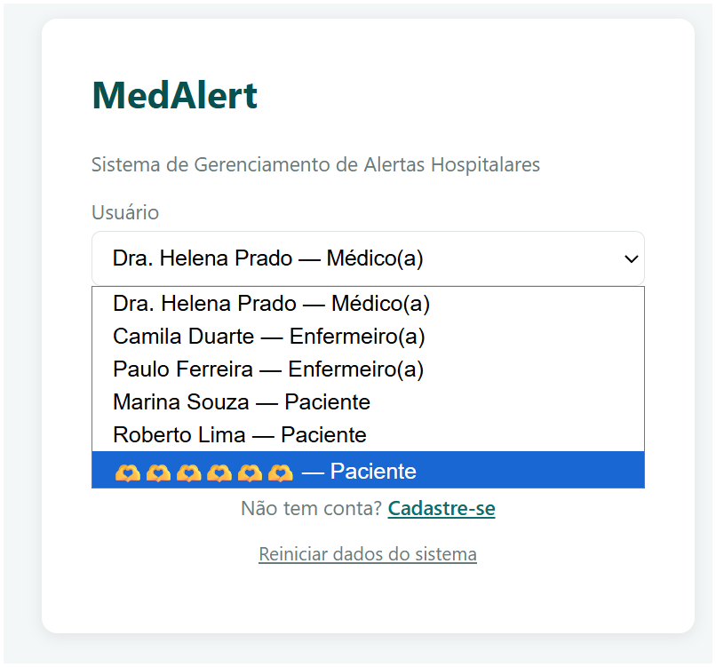

---

# 2. Login screen

## BUG-005 — Login only requires 1 password character and never checks if it's correct (login bypass)

- **Severity:** Critical (Security)
- **Layer:** Back-end
- **Test type:** Black-box (just try logging in with the wrong password and see if it's accepted)
- **Category:** Security
- **Module:** Login (`POST /api/auth/login`)
- **Evidence in code:** [server/routes/auth.js:31](server/routes/auth.js#L31) — the only validation that exists is `if (!password || password.length === 0)`, meaning the backend only rejects an **empty** password. Aside from that, **there is no comparison at all** against `user.password` (the real password stored in the database) anywhere else in the file.
- **Important:** it's not "no validation at all" — there technically is a validation (requires at least 1 character, rejects an empty string). The bug is that this is the **only** check: the password is never actually compared against the correct one.

### Steps to reproduce
1. Open the login screen.
2. Select any user in the dropdown (the list comes from `/api/auth/directory`).
3. Type anything in the Password field — 1 character is enough (a letter, a digit, or even a blank space).
4. Click "Log in".

### Actual result
Login is accepted with any password, correct or not, as long as it has at least 1 character (including a single space " ").

### Expected result
The system should compare the submitted password against the user's registered password and reject incorrect passwords.

### Impact
Anyone who knows (or can guess) a user's email — and the email list is **public** via `/api/auth/directory` — can log in as that user without knowing the real password. This compromises login for doctors, nurses, and patients alike.

### Confirmed in manual testing
Tested with **all 5 users** registered in the system — in every case, a login with a single-character password (any letter or digit) was accepted normally:

| Name | Role | Email |
|------|--------|--------|
| Dr. Helena Prado | Doctor | helena@medalert.test |
| Camila Duarte | Nurse | camila@medalert.test |
| Paulo Ferreira | Nurse | paulo@medalert.test |
| Marina Souza | Patient | marina@medalert.test |
| Roberto Lima | Patient | roberto@medalert.test |

This confirms the bug isn't specific to one user or role — it affects login for doctors, nurses, and patients alike.

Also tested with a **newly self-registered** account (Patient role), with a real password set at registration as `123456` — even so, login was accepted by typing just 1 character as the password, ignoring the 6-digit password that had been registered. This confirms the issue isn't tied to the simple seeded passwords ("senha123"): **no account in the system has its password validated at login**, regardless of how or when it was created.

### Confirmed in automated testing (Cypress, real Electron/Chromium browser)
The test selects Marina (a real seeded user) and types a clearly wrong 1-character password. The final assertion expects the header (`.topbar`) **not** to appear (login should have been rejected), but it appears — Cypress tries for 4 seconds (default retry timeout) before giving up and failing:
```
AssertionError: Timed out retrying after 4000ms: Expected <header.topbar> not to exist in the DOM, but it was continuously found.
```
That ~4s delay before failing is expected, not a hang or a script error — it's the header actually being rendered, confirming the login was accepted with the wrong password. This same mechanism (login via BUG-005 + asserting the header shouldn't exist) is reused in the automated tests for BUG-003 and BUG-004, to prove those "invalid" accounts can also log in normally.

### Evidence (screenshot)
<!-- Paste screenshot(s) for this bug here -->
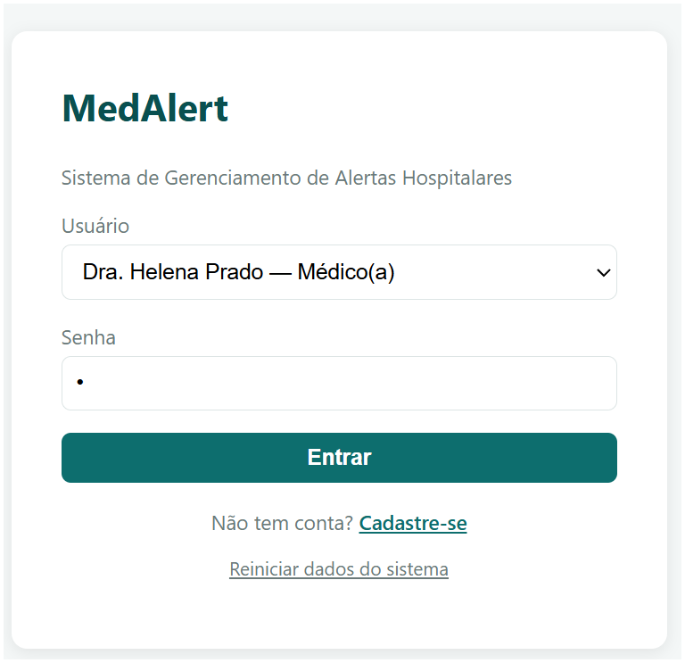

---

## BUG-006 — `/api/auth/directory` exposes every user's email with no login required

- **Severity:** High (Security / data exposure)
- **Layer:** Back-end
- **Test type:** Gray-box (the route isn't linked from any button on screen — only visible by opening the Console/DevTools and watching network requests, or by typing the address directly)
- **Category:** Security
- **Evidence in code:** [server/routes/auth.js:9-15](server/routes/auth.js#L9-L15) — a public route, with no `requireAuth`, returns the name, role, and email of every user (doctors, nurses, **and patients**).
- **Different from the other bugs on this list: this is an intentional design decision, not an implementation error.** The code comment itself says the route exists "to populate a quick login selector on the front-end" and that it's "not a security problem on its own" — it's a business rule from the training version of the app (letting you pick a user from a dropdown instead of typing an email), not a coding bug like BUG-005, BUG-008, or BUG-018.

### How to test (step-by-step)
1. Open a private/incognito browser tab (or log out, if logged in) — the key point is **not being logged in**.
2. In the address bar, type: `http://localhost:3000/api/auth/directory`
3. Press Enter.

**Expected:** an error should appear (`401 Unauthorized`).
**Actual (bug):** a text response (JSON — see glossary) appears with the name, email, and role of **every** registered user, including patients.

### Why it's still worth logging as a QA finding
Even though it's intentional, the decision has a real security consequence worth raising in the presentation: anyone, without being logged in, publicly discovers who is a patient at that hospital (inherently sensitive data) just by opening the login screen. And this same list is what makes BUG-005 exploitable with zero guessing effort — you don't even need to try emails, the screen hands them to you.

### Recommendation
In a production version, the login selector shouldn't expose email addresses or indicate who is a patient; a manually typed email field would deliver the same UX without this leak. As a QA finding, it should be reported as a "design decision with a real security side effect," not as a "coding error" — the write-up for the development team should differentiate it from BUG-005/BUG-008/BUG-018.

### Evidence (screenshot)
<!-- Paste screenshot(s) for this bug here -->
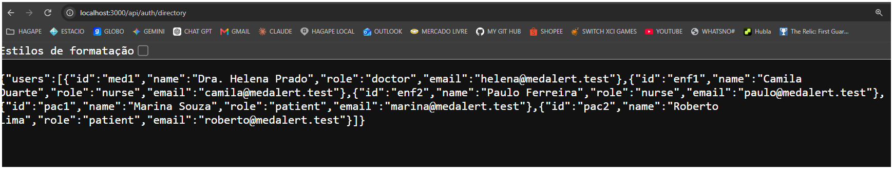

---

## BUG-007 — Full database reset with no authentication

- **Severity:** High (Security / destructive action)
- **Layer:** Back-end
- **Test type:** Black-box (the "Reset system data" link is visible right on the login screen)
- **Category:** Security
- **Evidence in code:** [server/index.js:35-38](server/index.js#L35-L38) — `POST /api/admin/reset` calls `seedDatabase()` (which **wipes everything**: users, patients, vitals, alerts, prescriptions) and doesn't go through `requireAuth`. The code comment itself says it's intentional, "for the class," but from a QA standpoint it's a real flaw: anyone, logged in or not, can wipe the production database with a single request.

### How to test (step-by-step)
1. Open MedAlert **without logging in** (stay on the home screen).
2. Click the **"Reset system data"** link (below the "Log in" button).
3. Confirm on the modal that appears ("This will erase all registrations... Continue?") by clicking **OK**.

**Expected:** should require administrator login before allowing this to proceed.
**Actual (bug):** the action happens immediately — the entire database is wiped and recreated from scratch, without any login. The confirmation modal that appears already shows the button is accessible to any visitor on the login screen, with no credentials at all.

### Expected result
Destructive endpoints shouldn't exist without authentication/administrator authorization, even in a training environment — worth logging as a finding, with the caveat that it's intentional for the project's teaching purpose.

### Evidence (screenshot)
<!-- Paste screenshot(s) for this bug here -->
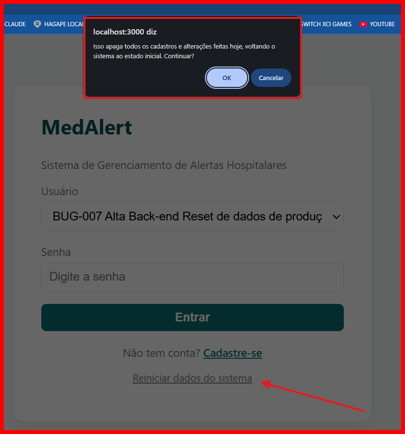

---

# 3. Post-login — Viewing patients

## BUG-008 — IDOR: reading any patient's data by ID

- **Severity:** Critical (Security)
- **Layer:** Back-end
- **Test type:** Gray-box (the normal screen doesn't let you see another patient's record — only found by changing the ID directly in the URL/Console)
- **Category:** Security
- **Evidence in code:** [server/routes/patients.js:32-47](server/routes/patients.js#L32-L47) — `GET /api/patients/:id` only requires `requireAuth`, never checks whether the logged-in user (doctor, nurse, or even the patient themselves) has any relationship with the requested `:id`.

### Steps to reproduce
1. On the home screen, in the **"User"** field select `Marina Souza — Patient`, in the **"Password"** field type anything (e.g., `x`), click **"Log in"**.
2. Without closing this tab, open a **new tab** in the same browser (the login stays valid automatically in the new tab too — see "Session cookie" in the glossary).
3. In that new tab's address bar, type `http://localhost:3000/api/patients/pac2` (this is Roberto Lima's ID, a different patient Marina has no connection to) and press Enter.

### Actual result
Returns the patient's complete medical record — private medical notes, vital signs, alerts, and prescriptions — even though the requester is neither the responsible doctor/nurse nor the patient themselves.

### Expected result
A patient should only see their own data; a nurse/doctor should only see the patients on their own caseload (the same rule already applied in `GET /api/patients`, but not replicated here).

### Confirmed in manual testing (direct API request, bypassing the UI)
Logged in as **Marina Souza** (pac1, Patient role), the normal screen (`GET /api/patients`) correctly shows only herself. But calling `GET /api/patients/pac2` directly (e.g., via `curl`, or intercepting the request in DevTools), the API returned Roberto Lima's (pac2) **complete** medical record, including the private medical note *"COPD under follow-up... Allergic to penicillin"* and his pending critical alert — data Marina should never be able to see.

### Evidence (screenshot)
<!-- Paste screenshot(s) for this bug here -->
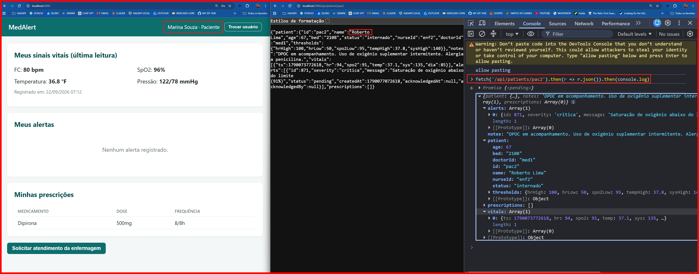

---

# 4. Nursing — Recording vital signs

## BUG-009 — Inconsistent temperature unit (°F on screen vs. °C in the business rule)

- **Severity:** High (Functional — affects a core function of the system)
- **Layer:** Front-end + Back-end
- **Test type:** Black-box (just record a normal Fahrenheit temperature and see if it triggers an improper alert)
- **Category:** Functional
- **Evidence (Front-end):**
  - Labels the temperature field as **°F** both in the nursing vital-signs form ([public/app.js:322](public/app.js#L322)) and in the patient's own view ([public/app.js:219](public/app.js#L219)), as well as in the doctor's history view.
  - But the doctor's thresholds screen labels the same field as **°C** ([public/app.js:500](public/app.js#L500)) — an inconsistency between the front-end's own screens.
- **Evidence (Back-end):**
  - The seeded data/default threshold (`temp_high: 37.8`, readings like `36.6`, `37.1`) only make sense as **Celsius** — [server/lib/seed.js:44](server/lib/seed.js#L44).
  - The alert rule ([server/lib/rules.js:19](server/lib/rules.js#L19)) compares the raw entered value against that threshold, with no unit conversion at all.

### How to test (step-by-step)
1. Log in as a nurse: user `Camila Duarte — Nurse`, any password (e.g., `x`).
2. Select patient **Marina Souza**.
3. On the vital signs tab, record: HR = 75, SpO2 = 97, **Temp. = 98** (the field says "°F"), Systolic = 118, Diastolic = 76 — all normal, except the temperature, which is 98 (a normal body temperature in Fahrenheit).
4. Click "Record vitals".
5. Go to the **Alerts** tab.

**Expected:** 98°F is a normal temperature — shouldn't generate any alert.
**Actual (bug):** a **"Fever — elevated temperature"** alert appears, because the system compares 98 directly against the 37.8 threshold (which is in Celsius), with no unit conversion.

### Actual result
If nursing staff enter a real body temperature in Fahrenheit (e.g., 98.6°F, a normal temperature), the system compares 98.6 against the 37.8 threshold and **always** triggers a fever alert, on every normal reading. The patient's own screen displays "36.6 °F," an absurd value for that unit.

### Expected result
The system's standard unit should be **°C**, not °F. The "°F" label is likely a leftover from the system originally being designed for an American/English-speaking context (where Fahrenheit is the clinical standard) — but the system is used in Brazil, every other interface text is in Portuguese, and the seeded thresholds/data were already defined in Celsius. In other words, the correct unit for the whole system is °C; the nursing input field currently labeled °F needs to be corrected to °C (as does any other place on screen that still shows "°F").

### Evidence (screenshot)
<!-- Paste screenshot(s) for this bug here -->
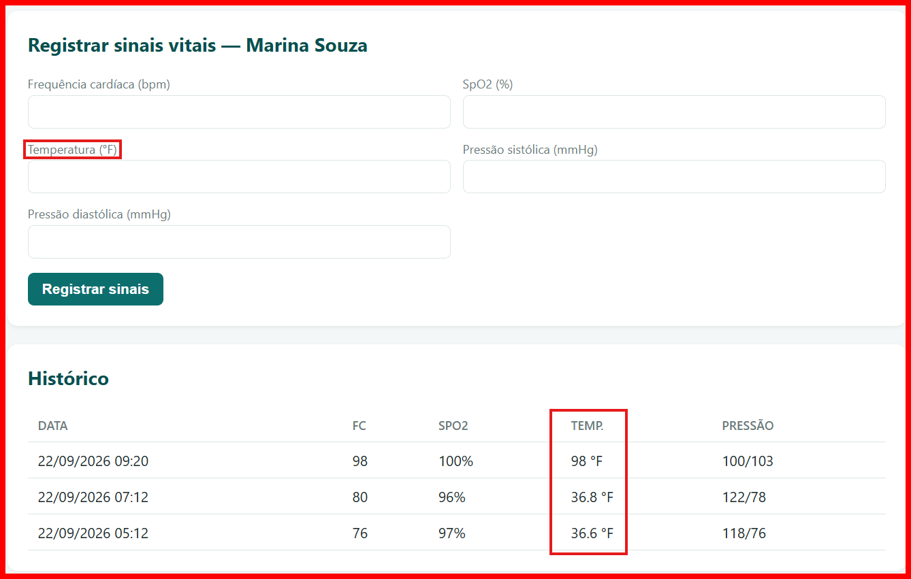

---

## BUG-010 — No range validation on vital signs (accepts absurd values)

- **Severity:** High (Data integrity)
- **Layer:** Front-end + Back-end
- **Test type:** Black-box (just test an impossible value, like a negative heart rate)
- **Category:** Functional
- **Evidence (Front-end):** [public/app.js:377](public/app.js#L377) — the nursing vital-signs form doesn't validate any range before submitting (the code's own comment already points this out).
- **Evidence (Back-end):** [server/routes/patients.js:51-64](server/routes/patients.js#L51-L64) only runs `Number(...)` on the received values, with no check against plausible physical limits — even if the front-end eventually validates, the API would accept any value coming straight from outside.

### How to test (step-by-step)
1. Log in as `Camila Duarte — Nurse`, any password.
2. Select patient **Marina Souza**.
3. Record vital signs with **HR = -50** (the rest can stay normal).
4. Click "Record vitals" and look at the **History**.

**Expected:** the system should block, or at least warn, that -50 bpm is an impossible value.
**Actual (bug):** accepted without complaint, and "-50" shows up normally in the list, as if it were a valid value.

### Actual result
The value is accepted and stored normally, entering the history and being used in alert calculations.

### Expected result
Physiologically plausible range validation both on the front-end (immediate user feedback) and on the back-end (defense in depth, since the API can be called directly).

### Evidence (screenshot)
<!-- Paste screenshot(s) for this bug here -->
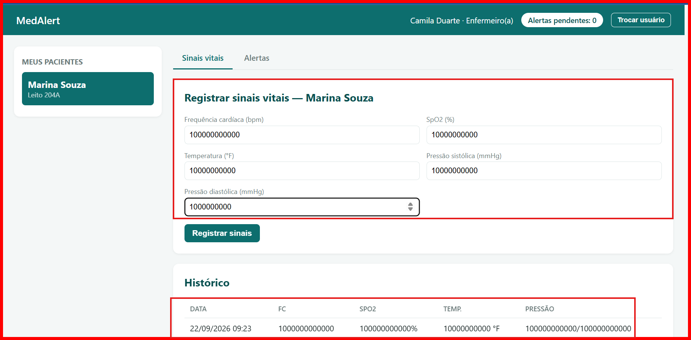

---

## BUG-011 — High-HR threshold uses `>` instead of `>=` (boundary error)

- **Severity:** Medium (Incorrect business rule)
- **Layer:** Back-end
- **Test type:** Black-box (boundary-value testing — recording exactly the threshold number is a classic QA technique, no code reading required; only the exact cause, `">"` instead of `">="`, came from reading the code afterward)
- **Category:** Functional
- **Evidence in code:** [server/lib/rules.js:16](server/lib/rules.js#L16) — the spec says "HR ≥ 100 triggers a HIGH alert," but the implementation uses `v.hr > patient.hr_high`.

### How to test (step-by-step)
1. Log in as `Camila Duarte — Nurse`, any password.
2. Select patient **Marina Souza** (her HR threshold is 100, same as Roberto's).
3. Record vital signs with **HR = 100** (exactly the threshold, no more, no less) and everything else normal.
4. Go to the **Alerts** tab.

**Expected:** the rule says "HR ≥ 100 triggers an alert" — 100 should trigger it.
**Actual (bug):** no alert appears with HR=100. It only triggers from 101 upward (repeat the test with HR=101 to confirm the alert does appear there).

### Actual result
A reading with HR exactly equal to the threshold (e.g., 100 when `hr_high = 100`) does **not** trigger an alert, contradicting the specified rule.

### Evidence (screenshot)
<!-- Paste screenshot(s) for this bug here -->


---

## BUG-012 — Duplicate alerts when the same vital sign is recorded repeatedly

- **Severity:** Medium (Operational noise)
- **Layer:** Back-end
- **Test type:** Black-box (just record the same signal twice and see if it duplicates in the list)
- **Category:** Functional
- **Evidence in code:** [server/lib/rules.js:22-24](server/lib/rules.js#L22-L24) — no duplicate/"cooldown" check at all; every time recorded vitals exceed the threshold, a new alert is created, even if an identical one is already pending for the same condition.

### Steps to reproduce
1. Log in as `Camila Duarte — Nurse` (`camila@medalert.test`, any password), select patient Marina Souza, and record vital signs outside the normal range (e.g., HR = 110, above the 100 threshold).
2. **Record the exact same vital sign again** (same values, a second time in a row) — you need to submit it twice; a single submission only generates 1 alert normally, which is not a bug.
3. Open the patient's "Alerts" tab (or query `GET /api/patients/:id`).

### Actual result
**Two** identical alerts appear ("Elevated heart rate (110 bpm)"), both pending, cluttering the nursing/doctor view. Confirmed live via API: two `POST /vitals` calls with the same payload each return `newAlerts:1`, resulting in 2 rows in the patient's `alerts` array.

### Expected result
Before creating a new alert, the system should check whether an identical alert is already pending (same patient, same message) and avoid duplicating it.

### Suggested improvement (optional, not required to fix the bug)
The minimal fix is simply for the back-end not to insert the repeated alert. As a UX "plus," when detecting that the condition already had a matching pending alert, the system could show a toast/notice to nursing staff (e.g., "This alert is already pending for this patient") instead of silently ignoring the new record — that way whoever is recording knows the duplicate was detected and isn't left wondering whether the record actually worked.

### Evidence (screenshot)
<!-- Paste screenshot(s) for this bug here -->


---

# 5. Alert management

## BUG-013 — Automatic escalation of critical alerts never happens

- **Severity:** High (Missing functionality / clinical risk)
- **Layer:** Back-end
- **Test type:** White-box (the symptom — an alert that doesn't self-escalate — can only be 100% confirmed by reading the code and seeing the function exists but is never called; from the screen alone, it would look odd but couldn't be proven to be an intentional bug rather than just "not enough time has passed yet")
- **Category:** Functional
- **Evidence in code:** [server/lib/rules.js:32-41](server/lib/rules.js#L32-L41) — `checkAutoEscalation()` implements the rule ("a critical alert pending for more than 15 minutes should self-escalate"), but the function **is never called from any route or any scheduler** (`setInterval`, etc.) — dead code.
- The seed data in [server/lib/seed.js:65](server/lib/seed.js#L65) deliberately creates a critical alert that's already 35 minutes old (> 15 min) to prove it **never** changes status on its own.

### How to test (step-by-step)
1. Click **"Reset system data"** (this recreates Roberto's critical alert already "pretending" to be 35 minutes old — no need to actually wait any real time).
2. Log in as `Paulo Ferreira — Nurse` (he's the one responsible for Roberto), any password.
3. Select patient **Roberto Lima**.
4. Go to the **Alerts** tab.

**Expected:** the critical alert ("Oxygen saturation below threshold") is already more than 15 minutes old — it should show as **"Escalated"** on its own.
**Actual (bug):** it shows as **"Pending"** — and will stay that way forever, no matter how long you actually wait or how many times you reload the page, because the function that would perform this escalation exists in the code but is never called anywhere. It only changes status if someone manually clicks "Escalate to doctor."

**How to confirm behind the scenes, without a terminal:** logged in as Paulo, open a new tab and paste `http://localhost:3000/api/patients/pac2`. In the text that appears, look for the critical alert's `"createdAt"` — it's a *timestamp* (see glossary at the top of the document): a large number representing "when it was created." Compared against the current timestamp (which you can get by pasting `Date.now()` in the browser Console), the difference already exceeds 15 minutes, even right after a reset — and `"status"` is still `"pending"` instead of `"escalated"`.

### Expected result
Critical ("critica") alerts pending for more than 15 minutes should automatically change to `escalated`, even without any manual nursing action — today it only escalates if someone manually clicks "Escalate to doctor."

### Evidence (screenshot)
<!-- Paste screenshot(s) for this bug here -->
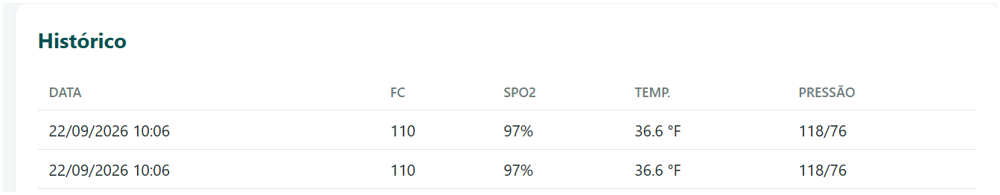

---

## BUG-014 — An alert can be "acknowledged" more than once

- **Severity:** Medium (Integrity / audit trail)
- **Layer:** Back-end
- **Test type:** Gray-box (the screen doesn't show who acknowledged it first — the overwrite is only discovered by looking at the raw API response in the Console/DevTools before and after the 2nd click)
- **Category:** Data integrity
- **Evidence in code:** [server/routes/alerts.js:9-18](server/routes/alerts.js#L9-L18) — `POST /:id/acknowledge` doesn't check the current `status` before overwriting `acknowledged_at`/`acknowledged_by`.

### Steps to reproduce
1. Log in as a **nurse**: `Camila Duarte — Nurse` (`camila@medalert.test`, any password). The "Acknowledge" button only exists on the nurse's screen; it doesn't appear for the doctor or the patient.
2. Select patient **Marina Souza** and generate a new alert (record a vital sign outside the normal range, e.g., HR = 110).
3. Go to the **Alerts** tab and click "Acknowledge" on that alert a first time.
4. Click "Acknowledge" **again, on the same already-acknowledged alert** — you need to acknowledge it twice; the first time alone works normally and is not a bug.

### Actual result
The second "Acknowledge" overwrites `acknowledged_at`/`acknowledged_by`, losing the record of who actually acknowledged it first and when — as if the first acknowledgment had never happened.

### Expected result
When trying to acknowledge an alert that's already `acknowledged`, the system should block the action or at least warn that it was already acknowledged by someone else, preserving the original record.

### Evidence (screenshot)
<!-- Paste screenshot(s) for this bug here -->


---

## BUG-015 — No flow control between "Acknowledge" and "Escalate": status flips back and forth, with inconsistent audit data

- **Severity:** Medium (Data integrity / audit trail)
- **Layer:** Back-end
- **Test type:** Gray-box (had to compare the API response at each step of the sequence to see the `acknowledgedBy`/`acknowledgedAt` fields misbehaving)
- **Category:** Data integrity
- **Evidence in code:**
  - `POST /:id/acknowledge` ([server/routes/alerts.js:9-18](server/routes/alerts.js#L9-L18)) sets `status='acknowledged'` without checking whether the current status is `escalated`.
  - `POST /:id/escalate` ([server/routes/alerts.js:20-26](server/routes/alerts.js#L20-L26)) sets `status='escalated'` without checking the current status, and **never clears** `acknowledged_at`/`acknowledged_by`.
  - The two routes have no notion of each other at all — there's no state machine (`pending → acknowledged → escalated`, with allowed/forbidden transitions), so any button can be clicked at any time, in any order.

### How to test (step-by-step)
1. Log in as `Camila Duarte — Nurse`, any password, and select Marina.
2. Record a vital sign outside the normal range (e.g., HR = 110) to generate a new alert.
3. On the Alerts tab, click **"Acknowledge"**.
4. Without leaving the screen, click **"Escalate to doctor"** on the same alert (which is now "Acknowledged").
5. Click **"Acknowledge"** again, on that same alert (which is now "Escalated").
6. Note the alert's status after each click.

**Expected:** once escalated, an alert shouldn't be able to "go back" to acknowledged — there should be a fixed order of statuses.
**Actual (bug):** the status keeps jumping between "Acknowledged" and "Escalated" with every click, in any order, and even mixes information (an "Escalated" alert can keep showing "acknowledged by Camila Duarte" at the same time).

### Confirmed in manual testing (real sequence, same alert)
I generated a new alert (HR 110 on Marina) and applied the actions in sequence, on the same alert:

| Step | Action | Result |
|---|---|---|
| 1 | Acknowledge | `status: "acknowledged"`, `acknowledgedBy: "Camila Duarte"` |
| 2 | **Escalate** (already-acknowledged alert) | `status: "escalated"` — but `acknowledgedBy`/`acknowledgedAt` **remain filled in**, as if it had been acknowledged and escalated at the same time |
| 3 | Acknowledge again (already-escalated alert) | `status` goes back to `"acknowledged"` — as if the escalation had never happened |

### Actual result
It's possible to flip an alert's status between "Acknowledged" and "Escalated" indefinitely, clicking the buttons in any order. An "Escalated" alert can simultaneously display "acknowledged by [name]" — a combination that makes no sense to whoever is looking at the screen (was it handled by nursing or sent to the doctor? Both, according to the data).

### Expected result
Define a clear state machine for the alert (e.g., `pending → acknowledged → escalated`, with no way back, or with an explicit "reopen" action if needed) and prevent transitions that don't make sense — at the very least, clear `acknowledged_at`/`acknowledged_by` on escalation, if escalating after acknowledgment is meant to be a valid transition.

### Difference from BUG-014
BUG-014 is about acknowledging the **same status** twice (loses who acknowledged first). This bug is about the lack of control **between different statuses** — the problem isn't just duplicating one action, it's the complete absence of a rule about which status transitions make sense.

### Evidence (screenshot)
<!-- Paste screenshot(s) for this bug here -->


---

## BUG-016 — "Pending alerts" counter at the top goes stale

- **Severity:** Low (UX / stale data on screen)
- **Layer:** Front-end
- **Test type:** Black-box (just observe the number at the top of the screen before/after a new alert)
- **Category:** Usability (UX)
- **Evidence in code:** [public/app.js:285-298](public/app.js#L285-L298) — `countPendingForMyPatients()` is only recalculated when the entire page is re-rendered (login, switching patients), not after acknowledging/escalating an alert or recording new vital signs within the same screen.

### How to test (step-by-step)
1. Log in as `Camila Duarte — Nurse`, any password.
2. Note the number next to **"Pending alerts"**, in the top-right corner of the screen (should show "0" right after a reset).
3. Without leaving this screen or switching patients, select Marina and record a vital sign outside the normal range (e.g., HR = 110).
4. Look at the "Pending alerts" number at the top again — **without reloading the page**.

**Expected:** the number should immediately become "1," since a new alert was just created.
**Actual (bug):** it keeps showing "0" until you switch patients or log out and back in — the counter doesn't notice on its own that something changed.

### Actual result
A nurse acknowledges the only pending alert for a patient, but the "Pending alerts: N" badge at the top keeps showing the old number until switching patients or logging in again.

### Evidence (screenshot)
<!-- Paste screenshot(s) for this bug here -->


---

## BUG-017 — "Acknowledge" alert button asks for no confirmation

- **Severity:** Low (UX — unprotected action, same pattern as BUG-020)
- **Layer:** Front-end
- **Test type:** Black-box (just click "Acknowledge" and see that it asks nothing)
- **Category:** Usability (UX)
- **Evidence in code:** [public/app.js:383-389](public/app.js#L383-L389) — the "Acknowledge" button's `onclick` calls `api.acknowledge(...)` directly, with no `confirm()` or modal. The "Escalate to doctor" button right next to it (lines 390-396) has the exact same problem.

### How to test (step-by-step)
1. Log in as `Camila Duarte — Nurse`, any password.
2. Select Marina and record a vital sign outside the normal range (e.g., HR = 110) to generate an alert.
3. Go to the **Alerts** tab and click the **"Acknowledge"** button.

**Expected:** a confirmation prompt should appear first, like "Confirm you want to acknowledge this alert?" — the same as happens with the "Reset system data" link.
**Actual (bug):** the action happens as soon as you click, asking nothing — there's no way to undo an accidental click.

### Actual result
A single click (including an accidental one, or an accidental double-click) already marks the alert as acknowledged, with no chance to cancel or confirm beforehand.

### Expected result
Before acknowledging (or escalating), the system should confirm the action — the same pattern already missing in BUG-020 (patient discharge).

### Why this matters more than it seems
Combined with **BUG-014** (acknowledging an already-acknowledged alert overwrites who/when it was really acknowledged first): an accidental click on "Acknowledge" isn't just "oops, I marked it as seen" — if another nurse had already acknowledged it before, the accidental click **silently wipes out that earlier record**, with no confirmation on either end (neither before acting, nor warning that an acknowledgment already existed). In a real situation, this could hide the fact that a critical alert was already handled by someone or, worse, give the false impression that it was handled when nobody actually looked at it.

### Evidence (screenshot)
<!-- Paste screenshot(s) for this bug here -->


---

# 6. Doctor — Thresholds, prescription, and discharge

## BUG-018 — IDOR: writing/altering any patient by ID

- **Severity:** Critical (Security)
- **Layer:** Back-end
- **Test type:** Gray-box (these actions have no button for a regular patient on screen — can only be triggered by calling the API directly through the Console/DevTools)
- **Category:** Security
- **Evidence in code:** the same missing relationship check in [server/routes/patients.js](server/routes/patients.js) across these routes:
  - `POST /:id/vitals` (line 51)
  - `PUT /:id/thresholds` (line 66)
  - `POST /:id/prescriptions` (line 82)
  - `POST /:id/discharge` (line 95)
  - `POST /:id/call-nurse` (line 103)

### How to test (step-by-step, using the browser Console)
These actions are the "write data" kind (POST/PUT) — you can't trigger them just by typing an address in the bar, unlike the read-only bugs. That's why the **browser Console** is used (see glossary at the top of the document).

1. Log in as **Marina Souza** (a regular patient) — `marina@medalert.test`, any password.
2. Open DevTools: press **F12** (or right-click → "Inspect") and click the **Console** tab.
3. Paste exactly this and press Enter:
   ```js
   fetch('/api/patients/pac2/discharge', { method: 'POST' }).then(r => r.json()).then(console.log)
   ```
4. The response will appear right there in the Console.

**Expected:** should return a `403` error — Marina has no relationship with Roberto (`pac2`) at all.
**Actual (bug):** returns `{ok: true}` — and Roberto is **actually discharged**, for real, by a regular patient with no doctor or nursing permission whatsoever.

⚠️ **After testing, click "Reset system data"** to undo the discharge and return everything to normal before testing other bugs.

Other variations to test the same problem (just swap the URL in the command above):
- `fetch('/api/patients/pac2/vitals', { method: 'POST', headers: {'Content-Type':'application/json'}, body: JSON.stringify({hr:-999, spo2:200, temp:40, sys:300, dia:200}) }).then(r=>r.json()).then(console.log)` — submits fake vital signs for Roberto.
- `fetch('/api/patients/pac2/thresholds', { method: 'PUT', headers: {'Content-Type':'application/json'}, body: JSON.stringify({hrHigh:999, hrLow:1, spo2Low:1, tempHigh:999, sysHigh:999}) }).then(r=>r.json()).then(console.log)` — changes Roberto's alert thresholds.

### Actual result
Any authenticated user — including a **patient** — can, by hitting the API directly: record vital signs on behalf of another patient, change any patient's alert thresholds, submit prescriptions, discharge any patient (including themselves), or trigger nurse calls for another patient.

### Expected result
Every action should validate the user's role and their relationship with the patient (a patient can only call the nurse for themselves; a nurse can only record vitals/acknowledge alerts for their own caseload; a doctor can only change thresholds/prescribe/discharge for their own patients).

### Confirmed in manual testing (direct API request, logged in as Marina/pac1 — Patient role)
All the calls below were made with **Marina Souza's (patient)** session, targeting patient **Roberto Lima (pac2)** — someone she isn't, and has no relationship with at all:

| Action tested | Request | Result |
|---|---|---|
| Change Roberto's alert thresholds | `PUT /api/patients/pac2/thresholds` `{hrHigh:999, hrLow:1, spo2Low:1, tempHigh:999, sysHigh:999}` | `{"ok":true}` — thresholds actually changed in the database |
| Submit fake vital signs for Roberto | `POST /api/patients/pac2/vitals` `{hr:-999, spo2:200, temp:40, sys:300, dia:200}` | `{"ok":true,"newAlerts":1}` — accepted, and it generated an alert |
| **Discharge Roberto** | `POST /api/patients/pac2/discharge` | `{"ok":true}` — Roberto's status actually became `"discharged"` |

In other words, a regular patient — with no nursing or medical permission whatsoever — actually managed to **discharge another patient** and pollute his clinical history with fabricated data. (The database was restored to its initial state via reset after the manual test, so as not to leave test data contaminating the demo.)

### Evidence (screenshot)
<!-- Paste screenshot(s) for this bug here -->


---

## BUG-019 — Prescription with no patient selected: front-end lets it submit, back-end responds "success" without saving

- **Severity:** High (Silent failure / data loss)
- **Layer:** Front-end + Back-end
- **Test type:** Black-box (just log in as a doctor with no patients and try to use the Prescription tab)
- **Category:** Functional
- **Evidence (Front-end):** the doctor's "Prescription" tab remains accessible even when `d === null` (no patient selected) — [public/app.js:439-440](public/app.js#L439-L440) — and the submit still calls the API anyway, with `selectedPatientId || 'undefined'` — [public/app.js:568](public/app.js#L568).
- **Evidence (Back-end):** `POST /:id/prescriptions` only saves if the patient exists, but responds `201 { ok: true, message: 'Prescription saved successfully.' }` even when there's no valid `:id`, with no `else` branch returning an error — [server/routes/patients.js:82-93](server/routes/patients.js#L82-L93).

### How to test (step-by-step)
1. Register a new doctor account (on the "Sign up" screen, "Doctor" role, any name/email) — since it's a newly created doctor, they have no patients linked yet.
2. Log in with that new account.
3. Notice that the "Overview" tab correctly shows "Select a patient from the list" (this already works correctly).
4. Click the **"Prescription"** tab even though no patient is selected.
5. Fill in the form (medication, dosage, frequency) and submit it.

**Expected:** the Prescription tab shouldn't even be accessible without a selected patient (same block the "Overview" tab already has).
**Actual (bug):** the form appears normally, lets you fill it in and submit it, and shows the **"Prescription saved successfully"** toast — but nothing is saved to the database, the prescription simply vanishes.

### Actual result
A doctor can fill in and "save" a prescription with no patient selected at all; the system shows a success toast, but nothing is persisted to the database — the prescription simply disappears.

### Expected result
The front-end shouldn't allow opening/submitting the form without a selected patient, **and** the back-end should validate and return an error (400/404) when the `:id` doesn't exist, instead of responding with success.

### Evidence (screenshot)
<!-- Paste screenshot(s) for this bug here -->


---

## BUG-020 — Patient discharge with no confirmation

- **Severity:** Low (UX — irreversible action with no protection)
- **Layer:** Front-end
- **Test type:** Black-box (just click "Discharge" and see that it asks nothing)
- **Category:** Usability (UX)
- **Evidence in code:** [public/app.js:532-540](public/app.js#L532-L540) — the "Discharge patient" button calls the API directly on `onclick`, with no `confirm()` or modal (unlike the "Reset system data" link, which does confirm — [public/app.js:150-157](public/app.js#L150-L157)).

### How to test (step-by-step)
1. Log in as `Dr. Helena Prado — Doctor`, any password.
2. Select any patient (e.g., Marina Souza).
3. Click the **"Discharge patient"** button.

**Expected:** a confirmation should appear beforehand ("Are you sure you want to discharge this patient?"), since it's an irreversible action — the same as the "Reset system data" link already does.
**Actual (bug):** the discharge happens immediately on click, asking nothing. If you want to undo it to keep testing other bugs, use "Reset system data."

### Actual result
A single, accidental click already finalizes the patient's discharge, with no chance to cancel.

### Evidence (screenshot)
<!-- Paste screenshot(s) for this bug here -->


---

## BUG-021 — "Discharge patient" button still looks active after the discharge

- **Severity:** Low (UX — missing visual feedback)
- **Layer:** Front-end
- **Test type:** Black-box (just compare the button's color before/after the discharge)
- **Category:** Visual
- **Evidence in code:**
  - [public/app.js:459](public/app.js#L459) — the button correctly receives the `disabled` attribute when `d.patient.status === 'discharged'` (`${d.patient.status === 'alta' ? 'disabled' : ''}`), so it **functionally** stops responding to clicks after discharge — this part already works correctly.
  - The problem is visual: in [public/styles.css](public/styles.css) there's **no `:disabled` rule at all** — `.btn-danger` (line 26) always applies the same solid red, and the global `button{cursor:pointer}` rule (line 22) is also never overridden for the disabled state.

### How to test (step-by-step)
1. Log in as `Dr. Helena Prado — Doctor`, any password, and select a patient.
2. Note the color of the **"Discharge patient"** button (bright red) before clicking.
3. Click it to discharge the patient.
4. Compare the button's color **after** the discharge with its color before.

**Expected:** after the discharge, the button should change — turn gray/faded, change its text, or simply disappear from the screen — visually indicating it no longer works.
**Actual (bug):** the button remains **exactly the same red color** and still looks clickable — clicking it again does nothing (the click is blocked under the hood), but nothing on screen indicates that.

### Actual result
After a discharge, the button keeps the same bright red color and the same "clickable" cursor (`pointer`) as before — visually identical to its active state. It genuinely no longer accepts clicks (the HTML `disabled` attribute blocks the event from firing), but nothing on screen indicates that: no color change, no text change, it doesn't disappear, doesn't turn gray. Whoever is using the system has no visual cue at all that the action was already taken and the button is now inert — which is exactly the confusion of "the button doesn't go away."

### Expected result
After the discharge, the button should give some clear visual signal: turn gray/faded (`opacity` + `cursor: not-allowed` on `:disabled`), change the text to something like "Patient already discharged," or simply be removed from the screen — any of these options would already fix the missing feedback.

### Evidence (screenshot)
<!-- Paste screenshot(s) for this bug here -->


---

## Additional observations (not classified as standalone bugs)
- Every newly self-registered patient is always linked to the **first** nurse and the **first** doctor registered in the database (`LIMIT 1`, with no distribution criteria at all) — see [server/routes/auth.js:63-65](server/routes/auth.js#L63-L65) (Back-end). Not a runtime error, but a naive assignment rule worth mentioning in the presentation. (See also [FEATURES.md](FEATURES.md) — patient reassignment feature suggestion.)
- Patient registration doesn't collect age or bed number — they stay `null`/`—` until someone edits them directly in the database (Front-end, there's no screen for this).
